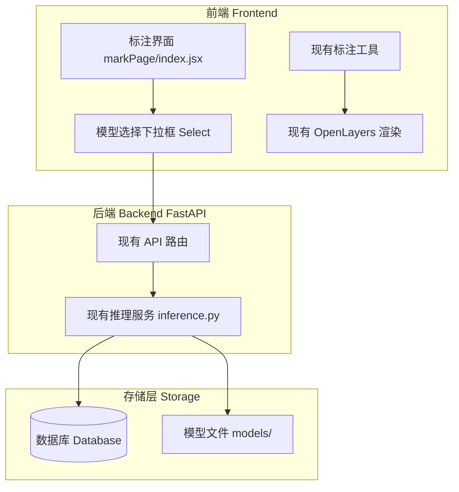
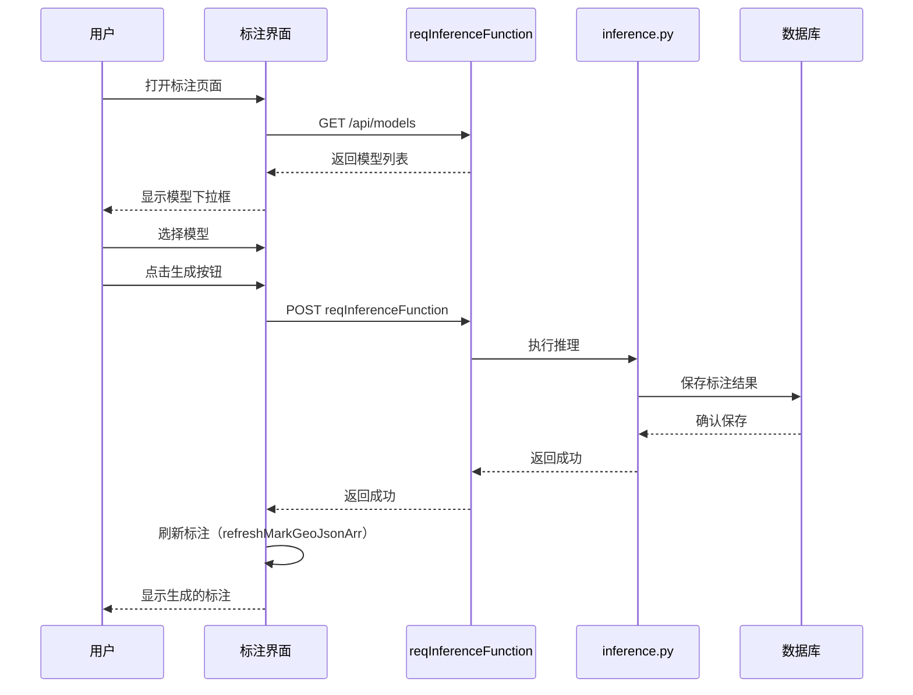

# 技术设计文档：模型辅助标注功能

## 概述

在现有标注页面的模型辅助工具区域增加模型选择功能，允许用户选择已训练的模型并一键生成标注结果。该功能复用现有的推理代码（inference.py）和标注渲染逻辑，最小化改动以降低引入错误的风险。

### 核心目标

- 在现有模型辅助工具区域增加模型选择下拉框
- 复用现有的 reqInferenceFunction API 和推理逻辑
- 复用现有的标注渲染逻辑（generateMarkLayer）
- 支持 YOLO（矩形框）和分割模型（多边形）

### 技术栈

- **前端**: React + OpenLayers（现有标注渲染）
- **后端**: FastAPI（现有 inference.py）
- **模型推理**: 复用现有推理代码
- **通信**: REST API（复用现有接口）

## 架构

### 系统架构图



### 组件交互流程



## 组件和接口

### 前端改动（最小化）

#### 1. 在模型辅助工具区域增加模型选择

**位置**: `Frontend(React)/portal/src/pages/markPage/index.jsx` 的模型辅助工具区域

**改动内容**:
```jsx
// 在现有的模型辅助工具区域增加
<div className="model-section">
  <h4 className="section-title">模型辅助工具</h4>
  <div className="model-tools">
    {/* 新增：模型选择下拉框 */}
    <Select
      placeholder="选择训练模型"
      style={{ width: '100%', marginBottom: 10 }}
      onChange={handleModelSelect}
      value={selectedModelId}
    >
      {modelList.map(model => (
        <Select.Option key={model.id} value={model.id}>
          {model.name} ({model.type})
        </Select.Option>
      ))}
    </Select>
    
    {/* 新增：生成标注按钮 */}
    <button 
      className="model-btn generate-btn" 
      onClick={handleModelInference}
      disabled={!selectedModelId}
    >
      生成标注
    </button>
    
    {/* 保留现有的快捷工具 */}
    <div className="quick-tools">
      <button className="model-btn extract-btn" onClick={handleExtractTarget}>
        XGBoost模型
      </button>
      <button className="model-btn sam-btn" onClick={handleSamPreAnnotation}>
        SAM模型
      </button>
    </div>
  </div>
</div>
```

**新增 State**:
```jsx
const [modelList, setModelList] = useState([]);
const [selectedModelId, setSelectedModelId] = useState(null);
```

**新增方法**:
```jsx
// 获取模型列表
useEffect(() => {
  const fetchModels = async () => {
    try {
      const result = await reqGetModelList({ userId: currentUser.id });
      if (result.success) {
        setModelList(result.data);
      }
    } catch (error) {
      message.error('获取模型列表失败');
    }
  };
  fetchModels();
}, []);

// 处理模型选择
const handleModelSelect = (modelId) => {
  setSelectedModelId(modelId);
};

// 处理模型推理（复用现有逻辑）
const handleModelInference = async () => {
  if (!selectedModelId) {
    message.warning('请先选择模型');
    return;
  }
  
  await save(); // 保存当前标注
  const hide = message.loading('正在进行模型推理...');
  
  try {
    const result = await reqInferenceFunction({
      model_id: selectedModelId,
      taskid: taskId,
      user_id: userId,
      // 其他参数根据现有 inference.py 的需求传递
    });
    
    hide();
    if (result.success) {
      message.success('推理完成');
      refreshMarkGeoJsonArr(); // 刷新标注显示
    } else {
      message.error(result.message || '推理失败');
    }
  } catch (error) {
    hide();
    message.error('推理失败');
  }
};
```

### 后端改动（最小化）

#### 1. 模型列表接口（可能需要新增或复用现有）

**接口**: `GET /api/models`

**功能**: 返回用户可用的训练模型列表

**响应**:
```json
{
  "success": true,
  "data": [
    {
      "id": "model_123",
      "name": "YOLO v8 - 车辆检测",
      "type": "yolo",
      "task": "detection"
    },
    {
      "id": "model_456",
      "name": "U-Net - 建筑分割",
      "type": "unet",
      "task": "segmentation"
    }
  ]
}
```

#### 2. 推理接口（复用现有 reqInferenceFunction）

**接口**: 复用现有的 `reqInferenceFunction`

**改动**: 在现有接口中增加 `model_id` 参数支持

**请求**:
```json
{
  "model_id": "model_123",
  "taskid": 123,
  "user_id": 456
}
```

**响应**: 保持现有格式，推理结果直接保存到数据库

#### 3. inference.py 改动

**改动点**: 支持通过 model_id 查询模型信息

```python
# 在 inference() 函数中
# 原来: MODEL_name = str(argv[4]).split(".")[0]
# 改为: 支持通过 model_id 从数据库查询模型信息

def inference(argv=None):
    TASK_ID = int(argv[1])
    MAPFILE_PATH = argv[2]
    USER_ID = int(argv[3])
    MODEL_ID = str(argv[4])  # 改为接收 model_id
    
    conn = connect_db()
    if conn is None:
        print("无法连接到数据库，程序退出。")
        return
    
    # 通过 model_id 查询模型信息
    model_inf = fetch_model_by_id(conn, MODEL_ID)
    
    # 后续逻辑保持不变，复用现有推理代码
    # ...
```

## 数据模型

### TrainedModel（简化）

```python
class TrainedModel:
    id: str
    name: str
    type: str  # yolo, unet, deeplab, fast_scnn, xgboost
    task: str  # detection, segmentation
    path: str  # 模型文件路径
    owner_id: int
```

### 数据库查询（新增或修改）

```python
def fetch_model_by_id(conn, model_id):
    """通过 model_id 查询模型信息"""
    cursor = conn.cursor()
    cursor.execute("""
        SELECT id, name, model_type, path, owner_id, output_num, status
        FROM models
        WHERE id = %s
    """, (model_id,))
    result = cursor.fetchone()
    if result:
        return {
            'id': result[0],
            'name': result[1],
            'model_type': result[2],
            'path': result[3],
            'owner_id': result[4],
            'output_num': result[5],
            'status': result[6]
        }
    return None
```

## 正确性属性（精简）

*属性是指在系统所有有效执行中都应该成立的特征或行为。*

### 属性 1：模型列表显示

*对于任何*用户，模型选择下拉框应该显示该用户可访问的所有训练模型。

**验证需求: 1.1, 1.2**

### 属性 2：单一模型选择

*对于任何*时刻，选中的模型数量应该小于或等于1。

**验证需求: 2.3**

### 属性 3：推理结果保存

*对于任何*成功的推理请求，生成的标注应该保存到数据库并在页面上显示。

**验证需求: 3.3, 4.3, 6.1**

### 属性 4：标注可编辑性

*对于任何*模型生成的标注，用户应该能够使用现有的编辑工具进行修改。

**验证需求: 5.1, 5.2, 5.3**

### 属性 5：模型类型支持

*对于任何*支持的模型类型（YOLO、DeepLab、U-Net、Fast-SCNN、XGBoost），系统应该能够正确执行推理。

**验证需求: 8.1-8.5**

## 错误处理

### 前端错误处理

1. **网络请求失败**
   - 显示错误消息，提供重试选项
   - 使用 message.error() 统一处理

2. **模型推理失败**
   - 显示具体错误信息
   - 建议用户选择其他模型或稍后重试

3. **未选择模型**
   - 禁用生成按钮
   - 点击时提示"请先选择模型"

### 后端错误处理

1. **模型加载失败**
   - 记录错误日志
   - 返回错误信息给前端

2. **推理超时**
   - 设置30秒超时
   - 超时后终止进程并返回错误

3. **数据库操作失败**
   - 事务回滚
   - 记录错误日志

## 测试策略（精简）

### 单元测试

#### 前端单元测试

使用Jest + React Testing Library：

1. **模型选择功能测试**
   - 测试模型列表加载和显示
   - 测试模型选择交互
   - 测试生成按钮的启用/禁用状态

2. **推理功能测试**
   - 测试推理API调用
   - 测试加载状态显示
   - 测试成功/失败消息显示

3. **错误处理测试**
   - 测试网络错误处理
   - 测试未选择模型的提示

#### 后端单元测试

使用pytest：

1. **模型查询测试**
   - 测试 fetch_model_by_id 函数
   - 测试模型不存在的情况

2. **推理流程测试**
   - 测试不同模型类型的推理
   - 测试推理结果保存

3. **错误处理测试**
   - 测试模型加载失败
   - 测试数据库连接失败

### 基于属性的测试（精简）

使用Hypothesis（Python）进行关键属性测试。

#### 配置要求

- 每个属性测试运行50次迭代（降低到50次以提高效率）
- 每个测试必须引用其设计文档属性
- 标签格式：**Feature: model-assisted-annotation, Property {number}: {property_text}**

#### 属性测试实现（精简）

**Python示例**：

```python
from hypothesis import given, strategies as st
import pytest

# Feature: model-assisted-annotation, Property 1: 模型列表显示
@given(
    user_id=st.integers(min_value=1),
    models=st.lists(st.builds(TrainedModel), max_size=10)
)
@pytest.mark.property_test(iterations=50)
def test_model_list_display(user_id, models):
    """对于任何用户，应该显示该用户可访问的所有模型"""
    accessible_models = get_user_models(user_id)
    assert all(m.owner_id == user_id or m.is_shared for m in accessible_models)

# Feature: model-assisted-annotation, Property 2: 单一模型选择
@given(
    model_ids=st.lists(st.text(min_size=1), min_size=2, max_size=5)
)
@pytest.mark.property_test(iterations=50)
def test_single_model_selection(model_ids):
    """对于任何时刻，选中的模型数量应该小于或等于1"""
    selector = ModelSelector()
    for model_id in model_ids:
        selector.select_model(model_id)
    assert len(selector.get_selected_models()) <= 1
```

**TypeScript示例**:

```typescript
import fc from 'fast-check';

// Feature: model-assisted-annotation, Property 2: 单一模型选择
describe('Property: Single model selection', () => {
  it('should maintain at most one selected model', () => {
    fc.assert(
      fc.property(
        fc.array(fc.string(), { minLength: 2, maxLength: 5 }),
        (modelIds) => {
          const selector = new ModelSelector();
          modelIds.forEach(id => selector.selectModel(id));
          expect(selector.getSelectedModels().length).toBeLessThanOrEqual(1);
        }
      ),
      { numRuns: 50 }
    );
  });
});
```

### 集成测试

1. **端到端工作流测试**
   - 用户登录 → 选择模型 → 生成标注 → 查看结果
   - 使用Playwright或Cypress

2. **API集成测试**
   - 测试前端和后端API的完整交互
   - 使用真实的HTTP请求

### 测试覆盖率目标

- 代码覆盖率：>70%
- 属性测试覆盖：5个核心属性
- 单元测试覆盖：所有主要功能和错误情况
- 集成测试：主要用户工作流
